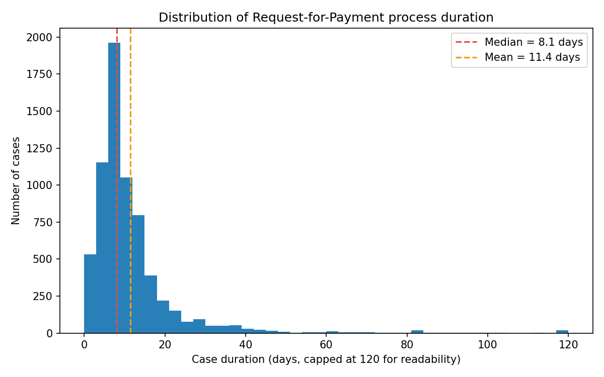
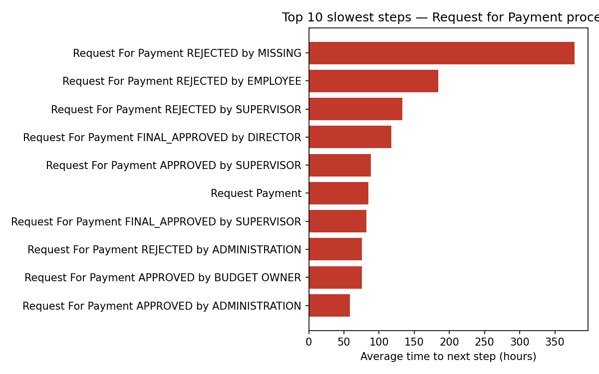
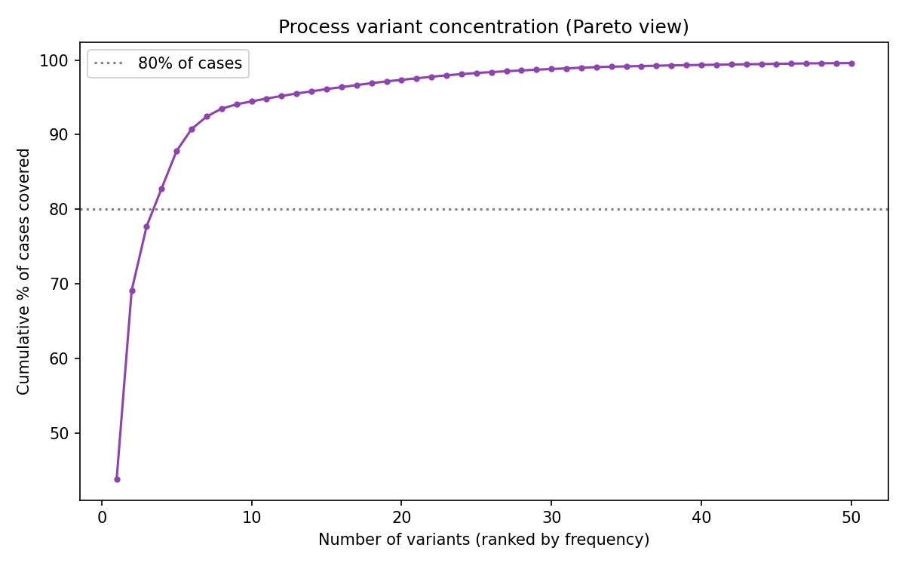
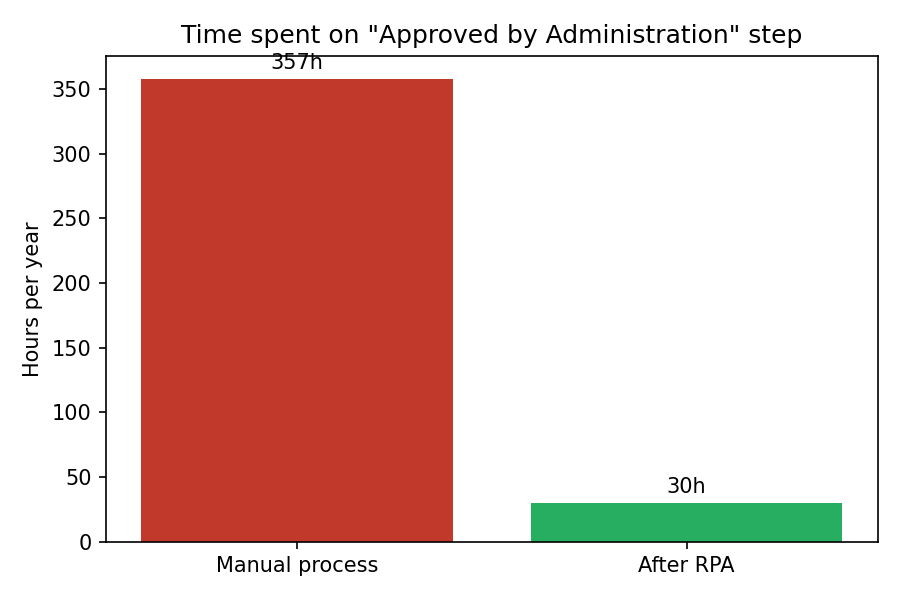

# Request-for-Payment Process Mining & RPA Opportunity Assessment

**A data-driven process analysis identifying bottlenecks, root causes, and
automation opportunities in a real-life financial approval workflow.**

---

## Executive Summary

This project analyzes **6,760 real Request-for-Payment cases** (36,072
events) using process mining to answer a concrete business question: *where
is this approval process losing time and money, and what should be
automated first?*

**Headline findings:**

| Metric | Value |
|---|---|
| Average case duration | 11.4 days |
| Median case duration | 8.1 days |
| Rework / rejection rate | 15.5% of cases |
| Duration penalty for rejected cases | +52% (16.1 vs 10.6 days) |
| Process variants | 77 total, but **4 cover 80% of all cases** |
| Top automation candidate | "Approved by Administration" — 5,362 occurrences/year |
| Estimated annual savings from automating it | **~€6,434 / ~328 hours** |

The process is, structurally, well-standardized (most cases follow one of a
handful of paths). The real cost driver is **rework caused by rejections**,
which extends case duration by half — meaning the highest-value fix is not
"more approval steps" but **better-quality submissions and faster
rejection-to-resubmission cycles**, combined with automating the most
repetitive formal checks.

---

## Business Problem

**Context.** Organizations processing employee payment requests (expense
reimbursements, vendor-style payments, internal disbursements) typically run
this through several sequential approval layers — administration check,
budget owner sign-off, supervisor and/or director approval — before payment
is released. This mirrors the broader Procure-to-Pay (P2P) pattern common in
finance shared-service centers (SSCs) and BPOs.

**Why it matters.** Multi-step approval workflows are a classic source of
hidden operational cost: every extra day a request sits idle is a delayed
payment, every rejection is duplicated effort for both the employee and the
approver, and every manual, rule-based check is a candidate for automation
that frees staff for higher-value work.

**Business objectives of this analysis:**
1. Quantify how long the process actually takes, and how consistent that is across cases.
2. Identify which specific activities or transitions are responsible for delay.
3. Determine why some cases take dramatically longer than others.
4. Assess how standardized the process is (how many "ways" a request can flow).
5. Translate findings into a concrete, costed automation recommendation.

**Questions this analysis answers:**
- How long does the process take on average, and how much does that vary?
- Which steps are the slowest, and which steps actually *cause* the delay (vs. just taking long by nature)?
- What share of cases require rework, and how much does rework cost in time?
- How many distinct process paths exist, and is the process standardized enough to automate confidently?
- Which specific steps should be automated first, and what is the expected ROI?

---

## Data

This analysis uses a real, open, anonymized event log:
**BPI Challenge 2020 — "Request For Payment"**

- 6,760 cases (payment requests), 36,072 events, 16 distinct activity types
- Collected at a real organization (Eindhoven University of Technology) and published as an open research dataset
- Citation: `van Dongen, B.F. (2020). BPI Challenge 2020. 4TU.ResearchData.`
- Cleaned log version sourced from [bptlab/bpi-challenge-2020](https://github.com/bptlab/bpi-challenge-2020)

---

## Methodology

1. **Data preparation** — loaded the XES event log, converted to a clean tabular format (pandas), sorted chronologically per case
2. **Process discovery** — built a Directly-Follows Graph (`pm4py`) to visualize the actual process flow as executed, not as documented
3. **KPI calculation** — case duration (mean/median/p90), throughput, events per case
4. **Bottleneck analysis** — average transition time between every pair of consecutive activities
5. **Variant analysis** — grouped cases by their exact activity sequence to measure process standardization
6. **Root cause analysis** — statistically compared rejected vs. non-rejected cases, and identified which activities are over-represented in the slowest 10% of cases
7. **Automation assessment** — scored each activity on volume, repetitiveness, and rule-based-ness
8. **ROI estimate** — costed the top automation candidate using transparent, stated assumptions

---

## KPI Results

| KPI | Result | Business interpretation |
|---|---|---|
| Average duration | 11.4 days | The "headline" number stakeholders usually ask for — but it's skewed by a long tail of slow cases |
| Median duration | 8.1 days | A better picture of the *typical* case — half of all requests finish within just over a week |
| 90th percentile duration | 20.3 days | 1 in 10 cases takes more than 3 weeks — this is the population worth investigating |
| Slowest case | 238 days | An extreme outlier — worth root-causing individually in a real engagement |
| Avg. events per case | 5.3 | A fairly lean process — most cases don't loop excessively |
| Avg. weekly throughput | 65 cases/week | Useful as a capacity-planning baseline |
| Rework / rejection rate | 15.5% | Roughly 1 in 6 requests needs to be redone — a clear improvement target |



The distribution is heavily right-skewed: most cases cluster around 5–10
days, but a long tail stretches out to extreme outliers — a classic signal
that a small number of cases are breaking the "normal" process and deserve
individual investigation rather than a blanket policy change.

---

## Bottleneck Analysis



**Key finding: the slowest transitions in the process are not approvals —
they are rejections.**

| Slowest step (avg. time to next action) | Hours | Business meaning |
|---|---|---|
| Rejected by Missing (info) | 378h (~16 days) | Requests rejected for missing information stall the longest — likely waiting on the employee to notice and respond |
| Rejected by Employee | 184h (~7.7 days) | Once rejected, employees take over a week on average to resubmit |
| Rejected by Supervisor | 133h (~5.5 days) | Supervisor-level rejections also create multi-day stalls |
| Final Approved by Director | 118h (~4.9 days) | The final sign-off step itself has notable latency |
| Approved by Administration | 59h (~2.5 days) | The highest-*volume* step, but not the slowest — it's a throughput problem, not a delay problem |

**Why this matters:** if a process owner only looked at "which step takes
the most total time," they might assume the approval levels need to be
cut. The data says otherwise — **approvals are reasonably fast; rejections
are what's slow.** This redirects the improvement effort toward (a) reducing
the rejection rate itself and (b) speeding up the rejection→resubmission
loop (e.g., automated reminders), rather than removing approval layers that
are actually working fine.

---

## Root Cause Analysis

**Question: why do some cases take so much longer than others?**

**Finding 1 — Rejections are the single biggest driver of delay.**

| | Mean duration | Median duration | Cases |
|---|---|---|---|
| No rejection | 10.6 days | 8.0 days | 5,709 |
| At least one rejection | 16.1 days | 8.6 days | 1,051 |

Cases with at least one rejection take **52% longer on average** than cases
that go through cleanly. This is the clearest, most actionable root cause in
the data: **reducing the rejection rate has a direct, multiplicative effect
on total cycle time** — not just an additive one.

**Finding 2 — Process complexity (number of steps) has a moderate
correlation with duration (r = 0.36).** More steps generally means more
time, but the relationship is moderate rather than strong — meaning a case
isn't slow *just* because it has more steps; *which* steps it hits matters
more than *how many*.

**Finding 3 — Activities over-represented in the slowest 10% of cases:**

| Activity | Over-representation in slow cases |
|---|---|
| Rejected by Employee | +3.8 pp |
| Rejected by Administration | +2.7 pp |
| Approved by Budget Owner | +2.0 pp |
| Rejected by Supervisor | +1.2 pp |

Every one of the top over-represented activities (except Budget Owner
approval) is a **rejection**. This independently confirms Finding 1 from a
different angle: rejections aren't just *correlated* with slow cases, they
are *concentrated* in them.

**Conclusion:** the root cause of process slowness is not the approval
chain's length — it's the rework loop triggered by rejections. Any
improvement initiative should prioritize reducing rejection rate (better
upfront data validation, e.g. via RPA) over restructuring the approval
hierarchy.

---

## Process Variants Analysis



| Metric | Value |
|---|---|
| Total distinct process variants | 77 |
| Variants needed to cover 80% of cases | **4** |
| Coverage of the top 10 variants | 94.5% |

| Rank | Cases | % of total | Steps | Path (simplified) |
|---|---|---|---|---|
| 1 | 2,961 | 43.8% | 5 | Submit → Admin Approve → Supervisor Final Approve → Request Payment → Payment Handled |
| 2 | 1,710 | 25.3% | 6 | Submit → Budget Owner Approve → Admin Approve → Supervisor Final Approve → Request Payment → Payment Handled |
| 3 | 583 | 8.6% | 4 | Submit → Supervisor Final Approve → Request Payment → Payment Handled |
| 4 | 343 | 5.1% | 3 | Submit → Request Payment → Payment Handled |

**Interpretation:** this is a **well-standardized process** — despite 77
theoretically possible paths, in practice almost all volume flows through
just 4 of them. This is good news for automation: a bot built to handle the
top 2–4 variants would cover the vast majority of real-world volume without
needing to handle dozens of edge cases.

**Recommendation:** standardize the long tail. The remaining ~70 variants
collectively cover only 5.5% of cases — many are likely caused by
exceptions, missing-data loops, or inconsistent manual handling. These are
candidates for either process-design fixes (eliminate the exception path) or
explicit exception-handling rules in the future-state design, rather than
full automation.

---

## Automation Opportunities Assessment

*(Acting as an RPA Consultant — scoring each activity on volume,
rule-based-ness, and judgment required.)*

| Activity | Volume/year | Automation Potential | Expected Benefit | Priority |
|---|---|---|---|---|
| **Approved by Administration** | 5,362 | **High** — formal, rule-based completeness check | ~328 hrs/year saved, ~€6,434/year | **P1 — Immediate** |
| Final Approved by Supervisor | 6,226 | Medium — partially rule-based (amount thresholds), partially judgment | Moderate time savings if combined with amount-based auto-approval | P2 — Near-term |
| Approved by Budget Owner | 1,954 | Medium — rule: auto-approve if within remaining budget | Reduces a 2nd manual touchpoint per case | P2 — Near-term |
| Rejected-case reminder/escalation | 1,051 cases/year affected | High — simple time-based trigger, not a judgment task | Cuts the ~7-day average resubmission delay significantly | **P1 — Immediate** |
| Submitted by Employee | 7,361 | Low — requires the employee's own judgment about the request | None — out of scope for automation | — |
| Rejected by Employee/Supervisor/Admin (the decision itself) | 1,074 / 174 / 822 | Low — requires human judgment about why the request is invalid | None — out of scope, but the *consequence* (reminder) is automatable | — |
| Final Approved by Director | 37 | Low — low volume, high judgment, final sign-off | Not worth automating at this volume | P3 — Not recommended |

**Top 2 recommended automation initiatives:**
1. **RPA bot for "Approved by Administration"** — rule-based document/data completeness check, highest volume in the process, lowest risk.
2. **Automated rejection-reminder workflow** — not a complex bot, just an event-triggered notification/escalation; directly attacks the #1 root cause of delay (rejection-to-resubmission lag) identified above.

---

## Future-State (To-Be) Process

| Aspect | As-Is (Current) | To-Be (Improved) |
|---|---|---|
| Administration check | Manual review, ~2.5h avg. wait, 5,362×/year | RPA bot performs the completeness check instantly; human only handles flagged exceptions |
| Rejection handling | Employee notices rejection passively; ~7-day avg. delay to resubmit | Automated reminder fires immediately + escalation after 48h of inactivity |
| Budget Owner approval | Manual for all cases requiring it (1,954×/year) | Auto-approved if request is within pre-approved budget threshold; manual only above threshold |
| Process paths | 77 variants, long tail of rare exceptions | Top 4 variants formalized as the "standard path"; remaining exceptions routed to a dedicated case-handling queue instead of ad-hoc flows |
| Visibility | No proactive tracking of aging cases | Dashboard flags any case exceeding the 8-day median, before it becomes a 20+ day outlier |

**Expected impact of the To-Be design:**
- Removes ~328 hours/year of manual administration-check work
- Cuts rejection-to-resubmission delay, the single biggest driver of the 52% "rework penalty"
- Reduces Budget Owner manual touches for low-risk, low-amount requests
- Converts an unmanaged long tail of 77 variants into a small set of standardized paths plus one explicit exception queue

---

## Business Recommendations

**Quick wins (0–1 month):**
- Implement an automated reminder for rejected requests sitting idle >48 hours (directly targets the largest root cause of delay)
- Set up a simple aging dashboard to flag cases exceeding the median duration before they become extreme outliers

**Medium-term (1–3 months):**
- Build and deploy an RPA bot for the "Approved by Administration" completeness check
- Introduce a budget-threshold rule for auto-approving low-amount Budget Owner approvals

**Long-term (3–6+ months):**
- Re-design the approval workflow around the 4 dominant variants as the "happy path," with a dedicated exception-handling track for the long tail
- Extend automation to amount-based auto-approval at the Supervisor level for low-risk cases
- Feed root-cause categories (e.g., "missing info" rejections) back into the submission form to prevent the error at the source

**Automation initiatives, ranked:**
1. Administration-check RPA bot (P1)
2. Rejection-reminder automation (P1)
3. Budget-threshold auto-approval rule (P2)
4. Supervisor-level amount-based auto-approval (P2)

---

## Estimated Business Value

*(Assumptions stated explicitly, as in a real BA business case — adjust for
a specific organization's actual figures.)*

| Assumption | Value |
|---|---|
| Manual review time per "Administration" check | 4 minutes |
| Fully-loaded staff cost | €18/hour |
| Robot runtime per check | 20 seconds |
| Annual case volume (Administration step) | 5,362 |

| Result | Value |
|---|---|
| Manual hours/year (this step alone) | 357.5 h |
| Manual cost/year (this step alone) | ~€6,434 |
| Hours after automation | 29.8 h |
| **Hours saved/year** | **~327.7 h** |
| **Estimated annual savings (this step alone)** | **~€6,434** |



This is a **conservative, single-step estimate**. A full business case would
also capture:
- Reduced rework cost from fewer rejections (1,051 cases/year × extra ~5.5 days of cycle time each)
- Faster cash-flow / vendor relations from shorter average payment cycle (11.4 → potentially single-digit days)
- Reduced Budget Owner manual touches (1,954 cases/year, partially automatable)

Combining all four levers plausibly pushes total potential impact into the
**low-to-mid five figures (€) per year and 500+ hours/year**, even before
accounting for second-order effects like reduced employee frustration and
faster vendor payment cycles.

---

## Dashboard Design (Power BI)

A recommended dashboard structure for ongoing process monitoring — see
[`dashboard_design.md`](dashboard_design.md) for full layout, DAX measure
suggestions, and page-by-page wireframe description. Summary:

- **Page 1 — Process Overview:** case volume, throughput trend, KPI cards (avg/median duration, rework rate)
- **Page 2 — Bottleneck View:** average step duration bar chart, process map
- **Page 3 — Variant Analysis:** Pareto chart, top-variant table, variant drill-through
- **Page 4 — Rework & Root Cause:** rejection rate trend, duration comparison (rejected vs. not), over-represented activities in slow cases
- **Page 5 — Automation Business Case:** activity volume vs. automation-potential matrix, ROI calculator with adjustable assumptions (what-if parameters)

---

## Skills Demonstrated

- **Process Mining:** event log processing, Directly-Follows Graph discovery, variant analysis (`pm4py`)
- **Business Analysis:** problem framing, KPI definition, root-cause analysis, stakeholder-ready reporting
- **RPA Consulting:** automation opportunity scoring, priority ranking, business case / ROI modeling
- **Data Analysis:** pandas-based statistical analysis, correlation analysis, distribution analysis
- **Data Visualization:** matplotlib (bottleneck charts, Pareto charts, ROI charts, distribution plots)
- **Dashboard Design:** Power BI structure planning for operational process monitoring

## Tools Used

Python, pandas, [pm4py](https://pm4py.fit.fraunhofer.de/), matplotlib, NumPy.
Dashboard design intended for Power BI (DAX measures specified in
[`dashboard_design.md`](dashboard_design.md)).

---

## Repository Structure

```
p2p-process-mining/
├── analysis.py                       # core analysis: process map, bottlenecks, ROI
├── advanced_analysis.py              # KPIs, variant analysis, root-cause analysis
├── dashboard_design.md               # Power BI dashboard structure & DAX measures
├── data/
│   └── RequestForPayment.xes.gz      # source event log (BPI Challenge 2020)
├── images/
│   ├── process_map.png
│   ├── bottleneck_chart.png
│   ├── roi_chart.png
│   ├── duration_distribution.png
│   ├── variant_pareto.png
│   ├── kpi_summary.csv
│   ├── process_variants.csv
│   ├── rca_summary.csv
│   ├── rca_rejection_impact.csv
│   ├── rca_activity_overrepresentation.csv
│   ├── step_durations.csv
│   ├── resource_stats.csv
│   ├── activity_frequency.csv
│   └── roi_estimate.csv
└── README.md
```

## How to Run

```bash
pip install pm4py pandas matplotlib numpy
python analysis.py
python advanced_analysis.py
```

## Data Source & License

The dataset is published by 4TU.ResearchData / the IEEE Task Force on
Process Mining as an open research dataset for educational and research
purposes. Citation: `van Dongen, B.F. (2020). BPI Challenge 2020.
4TU.ResearchData.`
