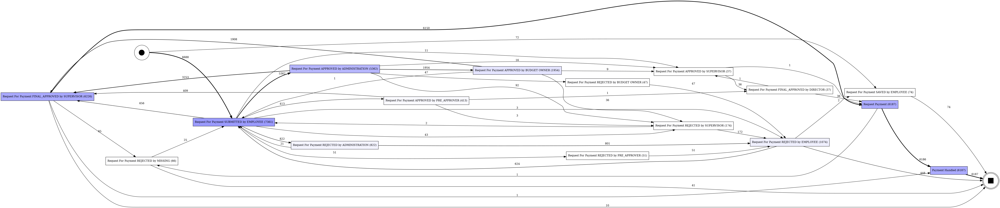

# P2P Process Mining — Request for Payment Bottleneck Analysis

## Project Overview

This project applies **process mining** techniques to a real-life business
process: discovering the process map directly from an event log, identifying
bottlenecks, measuring rework/rejection rates, and pinpointing steps that are
strong candidates for RPA automation.

The process is a P2P-style (Procure-to-Pay) workflow: an employee submits a
Request for Payment, which then passes through several approval levels
(Administration → Budget Owner → Supervisor → Director) before payment is
issued. Conceptually, this mirrors invoice-processing workflows in finance/SSC
departments — multiple verification and approval layers before a final
transaction.

## Data

This analysis uses a real, open, anonymized event log:
**BPI Challenge 2020 — "Request For Payment"**

- 6,760 cases (payment requests), 36,072 events, 16 distinct activity types
- Collected at a real organization (Eindhoven University of Technology) and
  published as an open research dataset
- Citation: `van Dongen, B.F. (2020). BPI Challenge 2020. 4TU.ResearchData.`
- Cleaned log version sourced from the open repository
  [bptlab/bpi-challenge-2020](https://github.com/bptlab/bpi-challenge-2020)

## What the script does (`analysis.py`)

1. Loads the event log (`.xes.gz`) and converts it into a clean tabular format
2. Discovers the process map (Directly-Follows Graph) — a visual diagram of
   how requests flow between process steps
3. Calculates the average time between each pair of steps — revealing where
   the process slows down
4. Calculates the share of requests that were rejected and resubmitted at
   least once
5. Calculates workload by resource type (human staff vs. automated system)
6. Calculates the frequency of each step — the most frequent, repetitive steps
   are the strongest RPA candidates

## Results

### Process Map



The map shows that a request can pass through several parallel approval
branches (Administration, Budget Owner, Supervisor, Pre-Approver) and loops
back to the employee for rework whenever it is rejected.

### Where the process slows down


**Key finding:** the slowest steps in the process are not the approvals
themselves, but the **rejections**. For example, "REJECTED by EMPLOYEE" takes
on average ~184 hours (about 7–8 days) until the next action happens. This
means the real bottleneck isn't approver workload — it's **input quality**:
employees take a long time to react to rejected requests.

### Rejection / rework rate

- **15.5% of all requests** (1,051 out of 6,760) were rejected at least once
  and sent back for rework
- This is a direct driver of extra workload for both employees and approvers
  — reducing this rate even by a few percentage points would yield a
  meaningful organization-wide time saving

### Step frequency (automation potential)

| Step | Count | RPA Potential |
|---|---|---|
| Submitted by Employee | 7,361 | Low — requires human judgment about request content |
| Final Approved by Supervisor | 6,226 | Medium — formal check, partially rule-based |
| **Approved by Administration** | **5,362** | **High — high-volume, repetitive, formal step** |
| Approved by Budget Owner | 1,954 | Medium — budget check, could use a rule like "auto-approve if amount < X" |
| Rejected by Employee | 1,074 | Low — requires human decision |

**Top 3 RPA automation candidates:**

1. **"Approved by Administration"** (5,362 cases) — the most frequent step
   after submission. It's a formal completeness/documentation check — an
   ideal RPA candidate: rule-based, high volume, low risk.
2. **Amount-based routing** — requests below a certain threshold could
   theoretically follow a simplified approval path without multiple levels of
   sign-off.
3. **Automated reminders on rejection** — since rejected requests sit idle for
   ~184 hours on average, a simple reminder trigger (no complex logic needed)
   could meaningfully reduce this delay.

## What should NOT be automated

Steps that require substantive judgment (Submitted by Employee, any
Rejection decision, Final Approved by Director) are left to humans, since
they require evaluating the actual content of the request rather than a
formal check.

## Repository Structure

```
p2p-process-mining/
├── analysis.py              # main analysis script
├── data/
│   └── RequestForPayment.xes.gz   # source event log (BPI Challenge 2020)
├── images/
│   ├── process_map.png            # process map diagram
│   ├── bottleneck_chart.png       # bottleneck chart
│   ├── step_durations.csv         # step duration table
│   ├── resource_stats.csv         # resource workload
│   └── activity_frequency.csv     # step frequency
└── README.md
```

## How to run

```bash
pip install pm4py pandas matplotlib
python analysis.py
```

## Tech stack

Python, pandas, [pm4py](https://pm4py.fit.fraunhofer.de/) (process mining
library), matplotlib.

## Data source & license

The dataset is published by 4TU.ResearchData / the IEEE Task Force on Process
Mining as an open research dataset for educational and research purposes.
When using this data, please cite the original source:
`van Dongen, B.F. (2020). BPI Challenge 2020. 4TU.ResearchData.`
